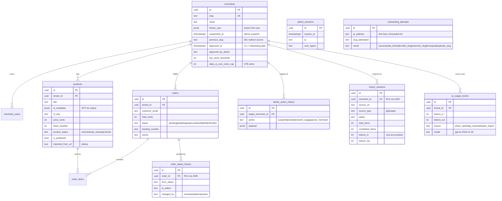
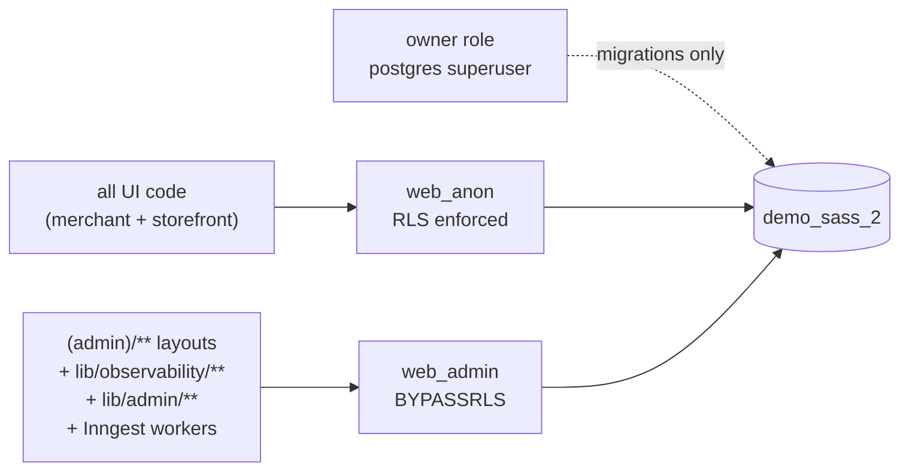
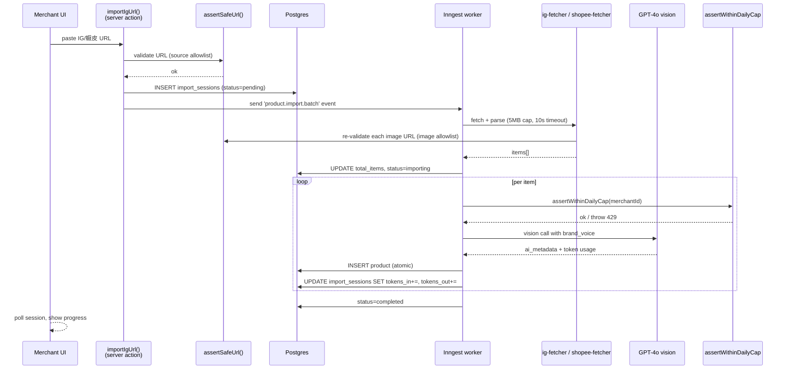
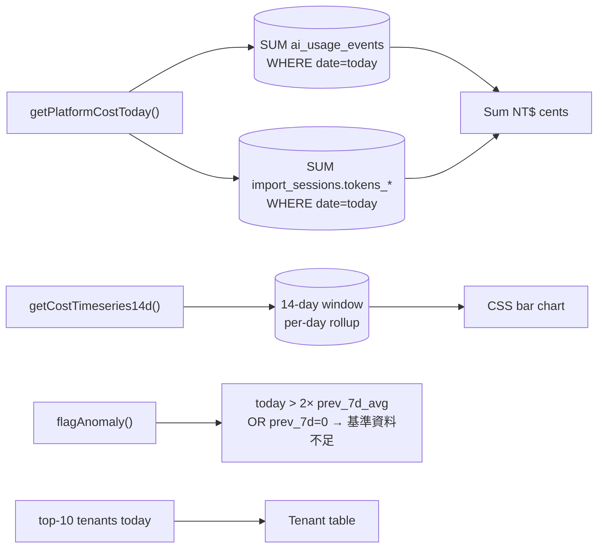

# Architecture

Engineering depth doc for `demo-sass-2`. Covers the patterns that make multi-tenancy, AI pipelines, and admin observability cohabit safely. Companion to [README.md](./README.md) and [STATUS.md](./STATUS.md).

---

## 1. Data model

11 tables, all defined in `src/db/schema.ts`. `tenant_id` is the multi-tenancy key on every tenant-scoped table; `order_status_history` and `import_sessions` derive isolation by JOIN to avoid storing redundant tenant columns that could drift.



Migration history (`drizzle/migrations/`):

| Migration | What | Version |
|---|---|---|
| `0000_moaning_mimic` | Initial Drizzle-generated schema | V1 P1 |
| `0001_init_rls` | `web_anon` / `web_admin` roles + base RLS | V1 P1 |
| `0002_low_wonder_man` | V1 column expansion (16 columns) | V1 P1 |
| `0003_v1_rls` | Tenant policies + `WITH CHECK` everywhere | V1 P1 |
| `0004_v15_provider_col` | `import_sessions.provider` (Gemini era) | V1.5 |
| `0005_revert_provider_col` | Drop `provider` after Gemini revert | V1.5 |
| `0006_ai_usage_events` | New table for sync-path AI usage | V1.5 fix |
| `0007_v17_onboarding_hardening` | `merchants.approved_at` + `onboarding_attempts` | V1.7 |

Every migration has a paired `*.rollback.sql`.

---

## 2. Multi-tenant RLS

The pool model: one Postgres database, `tenant_id` UUID column on every tenant-scoped row, RLS enforces isolation at the database layer. UI code can't accidentally select cross-tenant.

### 2.1 Role split



Defined in `db/init/01-roles.sql`:

```sql
CREATE ROLE web_anon LOGIN PASSWORD '...';
CREATE ROLE web_admin LOGIN PASSWORD '...' BYPASSRLS;
```

`BYPASSRLS` must be set on the LOGIN role directly — Postgres role inheritance does not propagate it.

### 2.2 `withTenantTx` pattern

Every tenant write or read on the user surface goes through `src/lib/db/with-tenant.ts`:

```ts
export async function withTenantTx<T>(
  tenantId: string,
  fn: (tx: Tx) => Promise<T>,
): Promise<T> {
  if (!UUID_REGEX.test(tenantId)) {
    throw new Error(`[withTenantTx] 無效 tenant_id 格式: ${tenantId}`);
  }
  return dbUser.transaction(async (tx) => {
    await tx.execute(sql`SELECT set_config('app.tenant_id', ${tenantId}, true)`);
    return fn(tx);
  });
}
```

Three properties matter:
1. **Transaction-scoped.** `is_local=true` resets the GUC at COMMIT/ROLLBACK so a connection returned to the pool can't leak the previous tenant.
2. **UUID guard before the SET.** `tenantId` flows in from the cookie. Format-validating it before binding into `set_config` is a belt-and-suspenders defense against injection.
3. **`dbUser` only.** The `dbAdmin` connection (BYPASSRLS) is intentionally not exposed here — there's no path to "set tenant context but bypass RLS anyway."

### 2.3 `WITH CHECK` everywhere

A common RLS mistake is writing `USING` policies (which gate `SELECT`/`UPDATE` reads) and forgetting `WITH CHECK` (which gates the *new* row produced by `INSERT`/`UPDATE`). Without `WITH CHECK`, tenant A can insert a row with `tenant_id = B` and the row exists; A just can't see it back. Migration `0003_v1_rls` writes both for every policy:

```sql
CREATE POLICY products_tenant_isolation ON products
  FOR ALL TO web_anon
  USING (tenant_id = current_setting('app.tenant_id')::uuid)
  WITH CHECK (tenant_id = current_setting('app.tenant_id')::uuid);
```

`order_status_history` and `import_sessions` use a JOIN-based variant — they don't store `tenant_id` directly, so the policy joins through `orders` / `merchants` and the `WITH CHECK` ensures the parent row is owned by the calling tenant.

### 2.4 Test coverage

`tests/rls.e2e.test.ts` (8 cases) is fail-closed:

- T1: missing tenant context returns zero rows
- T2: tenant A cannot read tenant B's products / orders / order_items
- T3: web_anon cannot escalate to BYPASSRLS via `SET ROLE`
- T4–T8: cross-tenant INSERT (with both correct and forged `tenant_id` payload) is blocked by `WITH CHECK`

Plus the 43-case `tests/v1-integration.test.ts` exercises tenant context end-to-end through the actual server-action paths.

---

## 3. AI import pipeline

The IG / 蝦皮 batch import is the most moving-parts feature in the system: untrusted URL → SSRF gate → HTML parse → image pull → vision call → DB write → live progress to the UI. Every step is bounded.



Key invariants:

- **SSRF gate runs twice per item.** Once on the user-pasted source URL (`source` allowlist: `instagram.com`, `shopee.tw`), and again on every `og:image` / item image URL the parser extracts (`image` allowlist: `cdninstagram.com`, `susercontent.com` CDNs). Redirects are followed manually with re-validation per hop — no `fetch` auto-redirect.
- **Cost cap is per-item, not per-batch.** `assertWithinDailyCap()` gates *each* vision call inside the loop, so a batch that crosses the cap mid-flight stops cleanly and marks failed items rather than burning the whole budget.
- **Atomic token accumulation.** `tokens_in` / `tokens_out` updates run inside `withTenantTx` plus Inngest `step.run()` idempotency, so a retry doesn't double-count usage.
- **Sync path has its own table.** `/api/products/generate` (single photo upload, no Inngest session) writes to `ai_usage_events`. `getDailyCostCents()` aggregates both `ai_usage_events` and `import_sessions.tokens_*`. This was a V1.5 smoke-test bug fix — the original design only wrote tokens via the worker path and `DailyCostChip` stayed at NT$0 forever.

See `src/inngest/functions/product-import-batch.ts`, `src/inngest/functions/product-ingest.ts`, `src/lib/observability/ai-cost.ts`, and `src/lib/observability/ai-cost-pricing.ts`.

---

## 4. Admin observability

The platform admin surface (`/admin`) does cross-tenant aggregation that user-facing code can't do. Three V1.6 features make this work without leaking BYPASSRLS into anything user-facing.

### 4.1 AI cost dashboard (`/admin/cost`)



Lives in `src/lib/observability/ai-cost-platform.ts`. The pricing constants (`USD_TO_TWD = 30`, GPT-4o input/output rates) are imported from `ai-cost-pricing.ts` so platform cost can't drift from per-merchant cost.

### 4.2 Operator queue (`/admin/queue`)

A cross-merchant inbox of "things that need an operator's attention." Severity P1–P5 hardcoded:

| Severity | Signal | Source |
|---|---|---|
| P1 | `pending_approval` (V1.7) | `merchants.approved_at IS NULL` |
| P1 | `paid_unshipped` >24h | `orders.status='paid'` |
| P2 | `zero_stock` / `zero_price` | `products.stock_quantity=0` / `price_cents=0` |
| P3 | `no_photo` / `low_stock` | `r2_key` matches `/fixtures/` / below threshold |
| P4 | `short_title` | `length(title) < 6` |
| P5 | `pending_unpaid` >7d | stale `orders.status='pending'` |

The implementation is **one compound CTE** (`product_signals` UNION `order_signals` LEFT JOIN `merchants`), not N+1 queries — this was an explicit Eng review callout. Suspended merchants are excluded. See `src/lib/admin/operator-queue.ts` and `tests/admin/operator-queue.test.ts` (5 cases).

### 4.3 `dbAdmin` containment

`dbAdmin` (BYPASSRLS) is a footgun. ESLint enforces who can import it:

```js
// eslint.config.mjs
const dbAdminRule = {
  rules: {
    'no-restricted-imports': ['error', {
      paths: [{
        name: '@/db',
        importNames: ['dbAdmin'],
        message: 'dbAdmin 會繞過 RLS。請改 import dbUser，...',
      }],
    }],
  },
};

// allowlist (dbAdmin permitted):
files: [
  'src/app/(admin)/**',           // platform admin UI
  'src/lib/observability/**',     // platform cost aggregation
  'src/lib/admin/**',             // operator queue
  'src/lib/onboarding/**',        // IP rate limit reads onboarding_attempts
  'src/lib/platform/**',          // marketplace home (cross-merchant)
  'src/lib/merchant/**',          // suspend guard reads merchant status
  'src/lib/tenant/resolver.ts',   // slug → tenant before RLS context exists
  'src/inngest/**',               // background workers
  'src/app/api/products/generate/**',  // sync vision needs brand_voice
  'src/app/onboarding/**',        // signup writes new merchant row
  'src/app/(merchant)/**',        // resolves cookie → tenant
  'src/app/(storefront)/**',      // storefront reads merchant theme/name
  'src/lib/admin-session.ts',     // admin session table CRUD
  'src/db/index.ts',              // the export itself
],
```

UI code that wants to read tenant data must use `dbUser` + `withTenantTx`. CI fails the build if anything else reaches for `dbAdmin`.

---

### 4.4 Honest threat model for `web_admin` (V2.2.8)

The /autoplan eng review flagged that earlier docs claimed "RLS mitigates container compromise." That claim was overstated and is corrected here.

**Reality:** `DATABASE_URL_ADMIN` (which uses the `web_admin` role with `BYPASSRLS`) is mounted as an environment variable in every server runtime — Vercel function, Cloud Run container, local Node process. Any code path executing inside that runtime has access to a connection that bypasses RLS.

**What this means:**
- An RCE in any server route, server action, or Inngest worker = full read/write access to all tenants' data, regardless of RLS.
- A leaked `dbAdmin` connection (e.g., a logged connection string) = same blast radius.
- RLS DOES still protect against application-logic bugs (a route that does `dbUser.select(...)` will not see other tenants' rows even if the query is mistyped). It does NOT protect against compromise.

**What we DO have, in order of strength:**
1. **ESLint `no-restricted-imports` allowlist** — prevents accidental `dbAdmin` use in routes that don't need it. Allowlist is in `eslint.config.mjs`. Auditing it is a one-grep job.
2. **Code review discipline** — every entry in the allowlist has a one-line justification comment naming the operation that requires BYPASSRLS (resolve merchant from cookie, fetch theme for storefront, etc.).
3. **Per-route audit during reviews** — when a route adds a new `dbAdmin` call site, the reviewer checks: does this read/write only data scoped to the current tenant via cookie? If not, it shouldn't be in a user-facing route.
4. **Suspended-merchant guard** — write paths additionally call `assertNotSuspended(tenantId)` so a suspended merchant cannot ship products even if they bypass UI gates. Read-only stays available.
5. **Rate limiting** — onboarding has DB-backed IP rate limits to make automated probing expensive.

**What we'd need for stronger protection:**
- Split admin operations to a separate runtime that doesn't accept user traffic (e.g., a separate Cloud Run service with its own IAM-bound `DATABASE_URL_ADMIN`, only reachable from internal jobs / scheduled functions).
- Alternatively, narrow `web_admin` to specific stored procedures rather than full DB access — still doesn't fix RCE-as-DB-access, but reduces query surface.
- Either approach is out of scope for portfolio; documenting the gap is the V2.2.8 deliverable.

**Auditing dbAdmin call sites today:**
```bash
# Every file that imports from @/db/admin-only or imports { dbAdmin } from @/db
grep -rn "from '@/db/admin-only'\|import.*dbAdmin" --include='*.ts' --include='*.tsx' src/
```

If a new file shows up here, the reviewer's job is to confirm it belongs in the eslint.config.mjs allowlist and to verify the queries inside are tenant-scoped or admin-context-justified.

---

## 5. Security layers

Defense-in-depth. Each layer has its own test file.

| Layer | Mechanism | File | Test |
|---|---|---|---|
| Multi-tenant isolation | Postgres RLS (`web_anon` role) + `WITH CHECK` | `src/lib/db/with-tenant.ts` + `drizzle/migrations/0003_v1_rls.sql` | `tests/rls.e2e.test.ts` (8) |
| BYPASSRLS containment | ESLint `no-restricted-imports` allowlist | `eslint.config.mjs` | CI lint |
| SSRF | Hostname allowlist (no regex) + DNS rebinding guard + redirect re-check + 5MB body cap + 10s timeout | `src/lib/import/url-guard.ts` | `tests/import/url-guard.test.ts` (15) |
| Admin auth — edge | HMAC-signed cookie, fail-closed on missing env | `src/middleware.ts` + `src/lib/admin-session-edge.ts` | `tests/admin-auth.e2e.test.ts` (15) |
| Admin auth — depth | DB session liveness check in `(admin)/layout.tsx` (catches revoked sessions) | `src/app/(admin)/layout.tsx` + `src/lib/admin-session.ts` | `tests/admin-auth.e2e.test.ts` |
| Suspended merchant | Storefront 「暫停營業中」+ write-path `assertNotSuspended()` | `src/lib/merchant/*.ts` | `tests/v1-integration.test.ts` |
| Pending merchant (V1.7) | `approved_at IS NULL` blocks storefront + writes; merchant-side banner | `src/app/(merchant)/layout.tsx` + storefront layout | `tests/onboarding/security.test.ts` (9) |
| Onboarding abuse — bots | Honeypot field (hidden `hp_url` input) | `src/app/onboarding/actions.ts` | `tests/onboarding/security.test.ts` |
| Onboarding abuse — flood | DB-backed IP rate limit (1 success / 24h) | `src/lib/onboarding/rate-limit.ts` | `tests/onboarding/security.test.ts` |
| Onboarding abuse — squatting | 28-entry reserved-slug list (`admin`, `api`, `_next`, `store`, `login`, ...) | `src/lib/onboarding/reserved-slugs.ts` | `tests/onboarding/security.test.ts` |
| Optimistic concurrency | `WHERE status = expected` + rowCount check on order status flips | `src/app/(merchant)/merchant/orders/[id]/actions.ts` | `tests/v1-integration.test.ts` |
| Webhook idempotency | `payment_webhooks (provider, external_id)` unique index | `src/db/schema.ts` | covered by `v1-integration` |
| AI cost cap | `assertWithinDailyCap()` gate before every AI call | `src/lib/observability/ai-cost.ts` | `tests/ai/cost-cap.test.ts` (15) |

Admin auth is fail-closed on three levels: missing env → 503, missing cookie → 307 to login, forged HMAC → 307. The middleware runs in Edge runtime (where `crypto.subtle` is available but `pg` is not), so the admin-session helpers are split into `admin-session-edge.ts` (HMAC verify only, no DB) and `admin-session.ts` (full DB CRUD for the layout check).

---

## 6. Frontend patterns

### 6.1 Brand-aware theming

Per-merchant CSS variables are written into the layout `<style>` tag from `merchants.theme_vars` JSONB:

```ts
// merchants.theme_vars example
{
  "--brand-primary": "#8B7355",
  "--brand-bg": "#FAF8F5",
  "--brand-text": "#2C2416",
  "--brand-radius": "2px",
  "--brand-font-heading": "Noto Serif TC,serif"
}
```

Every storefront component reads from these vars. There's a `.platform` palette swap class for the marketplace home + admin surfaces (warm gray instead of merchant brand color), which avoids fork-per-merchant components entirely. See `src/lib/themes.ts` and `src/components/theme/`.

### 6.2 State primitives (V1.6 B4)

Five server-component primitives, all using brand CSS vars and `tone='brand'|'neutral'`:

- `<StateSurface>` — base container
- `<EmptyState>` — first-run / filtered-to-zero states
- `<LoadingState>` — Suspense fallbacks
- `<ErrorState>` — error boundary content
- `<PartialState>` — "this widget failed but the rest of the page is fine"

The PartialState was Codex's design upgrade: blanking the entire dashboard because one of the four KPI cards crashes is bad UX. Tested via `renderToStaticMarkup` (no `@testing-library/react` needed) — 18 cases in `tests/components/feedback.test.tsx`.

### 6.3 MerchantInbox (V1.6 B5)

Replaces the older `PendingCallout` + `HealthCallout` with a single chip-family inbox that aggregates seven signal types (low stock, zero stock, no photo, short title, zero price, paid unshipped, stale pending) with severity-grouped color and a per-group cap of 5 chips + "+N more →" overflow. **One** compound query in `src/lib/merchant/inbox.ts` — explicit avoidance of round-trips. 4 integration tests.

### 6.4 MerchantSwitcher scale (V1.7 D2)

Originally `SELECT * FROM merchants` — fine for 2 demo tenants, broken at 100+. V1.7 replaced it with top-10-by-`updated_at` + `totalCount`, an inline search input with ESC + click-outside dismiss, and a dedicated `/merchant-switcher?q=&page=` full-list page with 20/page pagination and ILIKE on `name` + `slug`. Mobile uses near-fullscreen panel with 44px touch targets.

---

## 7. Testing strategy

154 vitest tests + 25-step manual smoke checklist (`tests/v1-smoke.md`).

### Patterns

- **Real Postgres, not mocks.** Tests connect to the same Docker Postgres and use `dbAdmin` to seed + clean. The RLS suite runs as `web_anon` to verify isolation; the rest run as `web_admin` for fixture setup speed.
- **UUID namespacing for cleanup.** Test fixtures use `99999999-...`-prefixed UUIDs to avoid colliding with seed data. `afterAll` cleans only its prefix.
- **Server-action testing via direct call.** Most server actions are tested by importing them and calling them with seeded tenant context — no HTTP layer needed. The 15 admin auth e2e cases hit the actual middleware via `next/server` invocation patterns.
- **Component tests via `renderToStaticMarkup`.** State primitives don't need a DOM — they're server components. Saves the `@testing-library/react` dependency and runs faster.

### Out of scope

- Real OpenAI vision call (smoke script exists at `scripts/test-vision.ts`, gated by `OPENAI_API_KEY`)
- Playwright E2E (deferred to V2 alongside cloud deploy)
- Load testing / fuzzing of the SSRF guard

---

## See also

- [README.md](./README.md) — entry point + feature list
- [STATUS.md](./STATUS.md) — version-by-version progression with concrete numbers
- [CHANGELOG.md](./CHANGELOG.md) — commit-level history
- [LOCAL_SETUP.md](./LOCAL_SETUP.md) — dev onboarding
- `tests/v1-smoke.md` — 25-step manual QA checklist
