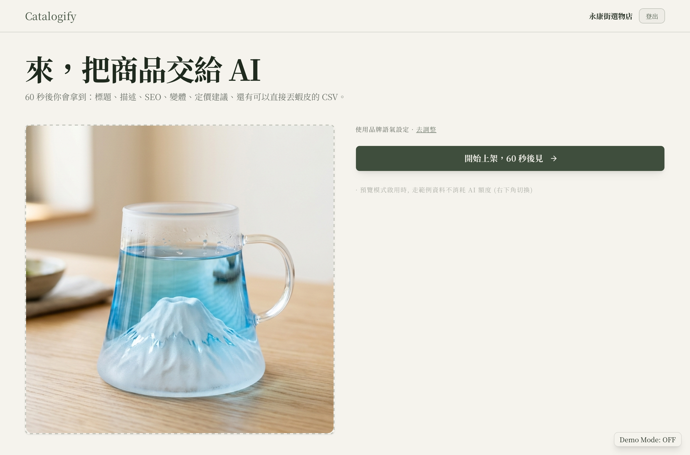
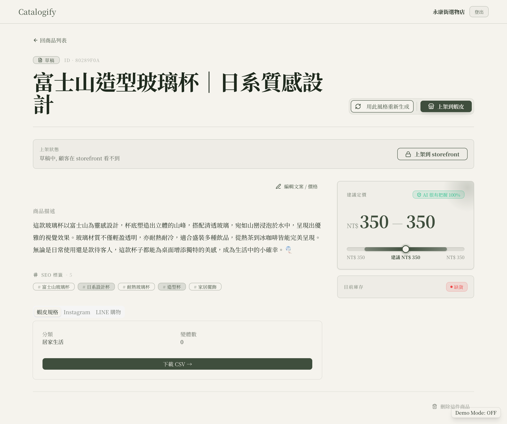
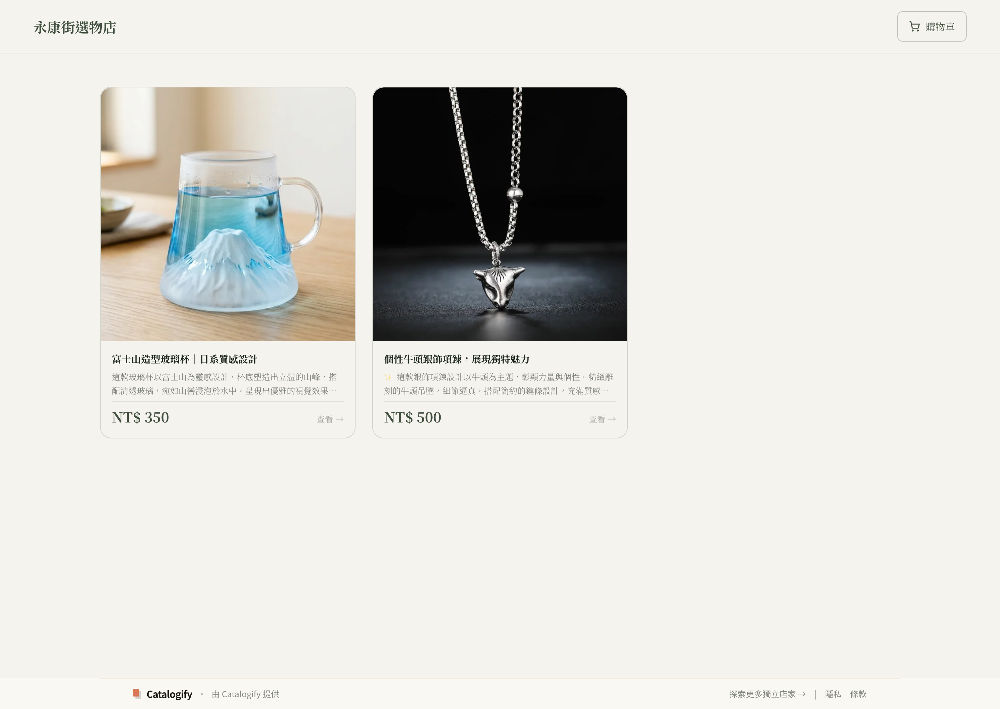
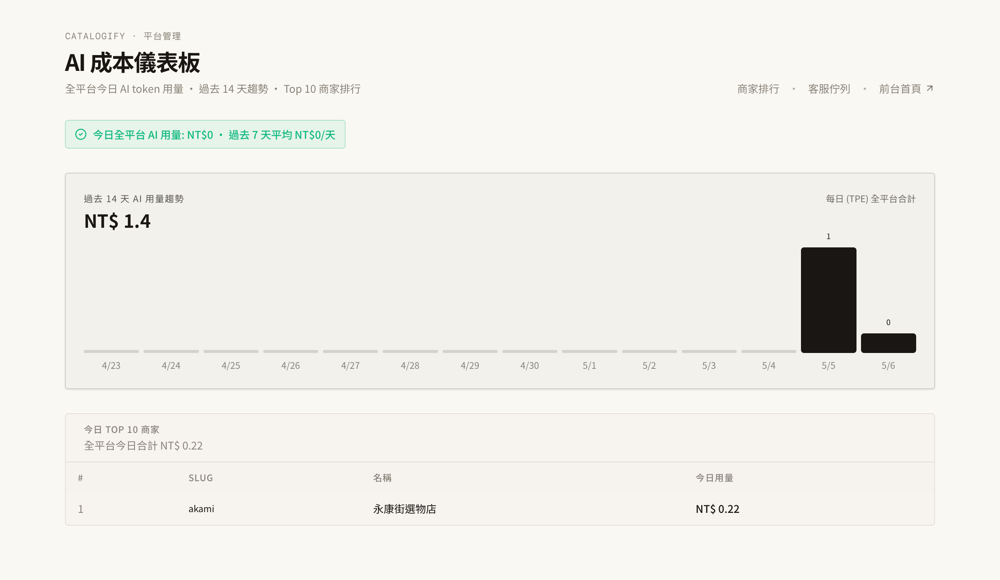
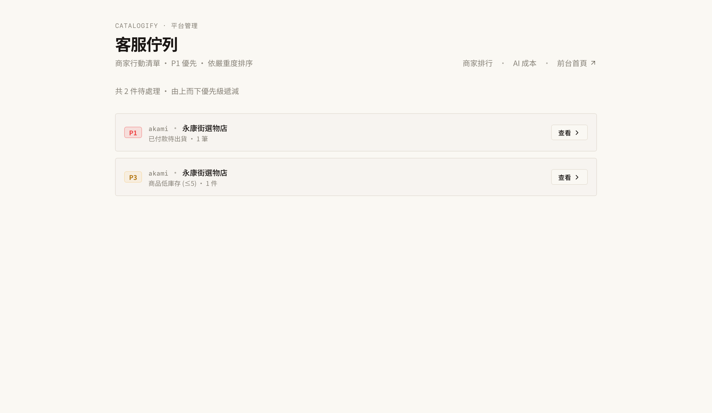
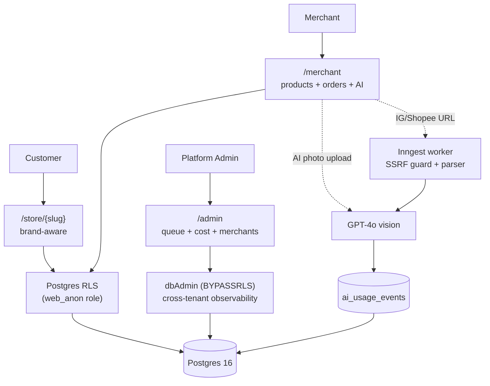

# rls-ai-shop

> A multi-merchant e-commerce platform for Taiwan's independent stores. AI photo→listing in ~7 seconds, multi-tenant Postgres RLS, and a platform-admin observability suite — built as a portfolio project that started life as a hackathon and was iterated through V2.6 to exercise real production patterns (cloud deploy, per-merchant auth, R2 storage, compile-time tenant isolation, security hardening).

**Live:** https://rls-ai-shop.vercel.app · **Storefront examples:** [/store/akami](https://rls-ai-shop.vercel.app/store/akami) · [/store/afen](https://rls-ai-shop.vercel.app/store/afen)

### Walkthrough — photo → AI listing in ~60s

<video src="https://github.com/user-attachments/assets/86eb6f26-1708-4655-aeed-10b1795d9a23" autoplay loop muted playsinline controls poster="./docs/hero/walkthrough-poster.jpg"></video>

Real AI photo→listing flow on the local env.

If the embed above doesn't render (npm package page, mirror, or some browsers): [▶ Play walkthrough (V2.3 release asset, 1.7 MB)](https://github.com/vincent97277/rls-ai-shop/releases/download/v2.3/walkthrough.mp4) · [Source `.mp4` in repo](./docs/hero/walkthrough.mp4) · [Poster image](./docs/hero/walkthrough-poster.jpg)

> **Portfolio / showcase project.** Public for learning, hiring, and reference. Limited active maintenance — see [.github/CONTRIBUTING.md](./.github/CONTRIBUTING.md) before opening PRs.

## Stack

Next.js 15 (App Router, Turbopack) · React 19 · TypeScript (strict) · Drizzle ORM 0.45 · Postgres 16 (Docker / Neon) · Inngest · OpenAI GPT-4o · Tailwind v4 · shadcn/ui · Vitest 2 · Playwright

Cloud: Vercel (sin1) · Neon Singapore · Cloudflare R2 (APAC) · Inngest Cloud

## Features

- **Multi-tenant storefronts** at `/store/{slug}` with brand-aware theming (per-merchant CSS variables for color, font, radius — set on the layout, no per-component styling forks)
- **AI photo → product listing** in ~7 seconds (GPT-4o vision + per-merchant brand voice) for synchronous single-photo upload
- **One-click batch import** from Instagram and 蝦皮 with SSRF defense, per-batch cost cap, and live progress over Inngest
- **Per-merchant authentication** — email + bcrypt password + DB-backed sessions, separate from platform-admin sessions
- **Order lifecycle** 待付款 → 已付款 → 已出貨 → 已完成 / 退款 with optimistic concurrency, audit log, and A4 print shipping slip
- **Platform admin tools** — sortable merchant ranking, AI cost dashboard with anomaly detection, cross-merchant operator queue (P1–P5 severity inbox)
- **Production-shaped onboarding** — admin approval queue, reserved-slug list, IP rate limit, and honeypot defense, all without email or captcha
- **Security-first by construction** — Postgres RLS with `WITH CHECK`, HMAC-signed admin sessions with DB liveness check, hostname-allowlist SSRF guard, ESLint-enforced `dbAdmin` containment

## See it in action

Three personas, one codebase. RLS keeps tenants apart; `dbAdmin` (BYPASSRLS) is allowlisted to platform surfaces only.

| AI photo → listing in ~7s (商家後台) | Per-merchant brand-aware storefront (顧客端) |
|---|---|
|  |  |
| GPT-4o vision generates title + description + SEO chips + price band, with confidence shown inline. Multi-channel export (蝦皮 / IG / LINE) per row. Cost gated by `assertWithinDailyCap()`. | Same `/store/{slug}` route, different CSS vars per tenant. Theme + font + radius driven by `merchants.theme_vars` JSONB. Tenant data isolation enforced at the Postgres RLS layer below the CSS. |

| AI cost dashboard (平台管理) | Operator queue (跨商家客服) |
|---|---|
|  |  |
| 14-day platform-wide AI token usage + per-merchant top-10. The cost cap is a load-bearing primitive — see `assertWithinDailyCap()`. | P1–P5 severity inbox aggregating action items across every tenant via cross-merchant CTE — `dbAdmin` BYPASSRLS, ESLint-allowlisted. |

[More screenshots →](./docs/screenshots/) — merchant dashboard, settings, products list, order detail, A4 print slip, storefront product detail, storefront brand comparison (akami + afen), customer order success, admin merchant ranking, merchant + admin login forms.

## Why this is interesting

For folks reading the source — the four load-bearing patterns:

- **RLS done right.** Every tenant write goes through `withTenantTx(tenantId, fn)` → `SET LOCAL app.tenant_id` inside a transaction. Migrations include `WITH CHECK` to block cross-tenant inserts, not just selects. See [`src/lib/db/with-tenant.ts`](./src/lib/db/with-tenant.ts) + 8 RLS e2e cases (incl. role-escalation test).
- **SSRF defense via hostname allowlist, not regex.** `assertSafeUrl()` parses with `new URL()`, DNS-resolves and rejects RFC1918/loopback/link-local v4+v6 to defeat DNS rebinding, follows redirects manually with re-validation per hop, 5MB body cap, 10s timeout. See [`src/lib/import/url-guard.ts`](./src/lib/import/url-guard.ts) + 15 unit cases.
- **AI cost cap as a load-bearing primitive.** `ai_usage_events` (sync) + `import_sessions.tokens_in/out` (batch) aggregated by `getDailyCostCents()`. `assertWithinDailyCap()` gates every AI call and returns 429 when over. USD→TWD rate isolated to `ai-cost-pricing.ts` so platform-cost code can't silently re-derive and drift.
- **`dbAdmin` AND `dbUser` restricted by ESLint allowlist.** Admin / observability / Inngest / system-query paths, plus 3 narrow user-facing exceptions: the 2 session-resolution layouts (cookie/slug → tenant) and `settings/actions.ts` (UPDATE on the merchants table, which has no RLS policy). UI **read** code goes through `withTenantTx(tenantId, async (tx) => ...)` — the wrapper is dbUser-backed under the hood. V2.6.x Tier 1 #4 added dbUser to the same rule because direct dbUser use skips the GUC and fail-closes to 0 rows; the dev's instinct after seeing 0 rows is to switch to dbAdmin to debug, which IS the leak. The lint rule is one of several layers — it stops accidental misuse, not adversarial bypass; RLS + WITH CHECK at the DB is the actual boundary. See [`eslint.config.mjs`](./eslint.config.mjs) + ARCHITECTURE.md §4.3.

Plus: production-shaped onboarding (admin approval queue + reserved-slug list + IP rate limit + honeypot, no email or captcha), defense-in-depth admin sessions (Edge HMAC + per-render DB liveness check), and V2.2 cloud deploy at $0/mo idle (Vercel sin1 + Neon Singapore + R2 + Inngest Cloud).

## Architecture

**Security model in 30 seconds**: UI **read** code talks to Postgres as `web_anon` (RLS-enforced). `dbAdmin` (BYPASSRLS) is allowlisted to admin / observability / Inngest paths plus 3 narrow user-facing exceptions (2 session-resolution layouts + the `settings/actions.ts` UPDATE path). Tenant context is set per-transaction via `withTenantTx(tenantId, fn)` with a UUID guard before the `set_config` call. Migrations enforce isolation with `WITH CHECK` on every policy, not just `USING`. The ESLint rule stops accidental misuse — RLS + WITH CHECK at the DB layer is the actual boundary; ARCHITECTURE.md §4.3 documents the rule's known bypass routes.

Deeper diagrams (data model, AI pipeline sequence, security layers) live in [ARCHITECTURE.md](./ARCHITECTURE.md).

## Project status

V1 hackathon → V2.0 per-merchant auth → V2.2 cloud deploy → V2.3 OSS readiness → V2.6 distribution sprint (RLS template positioning, AI SDK v6 migration, dbAdmin/dbUser ESLint containment, product rename to `rls-ai-shop`) · 304 tests · live at the URL above. Per-version detail: [STATUS.md](./STATUS.md). 90-day sunset gate decision @ 2026-08-06 (issue #27).

## Where to next

[Run locally](./LOCAL_SETUP.md) · [Deploy to cloud](./DEPLOY.md) · [Architecture deep-dive](./ARCHITECTURE.md) · [AI agent conventions](./CLAUDE.md) · [Standing rules](./DECISIONS.md) · [Contributing](./.github/CONTRIBUTING.md) · [Commit history](./CHANGELOG.md)

## License

Apache 2.0. See [LICENSE](./LICENSE).
