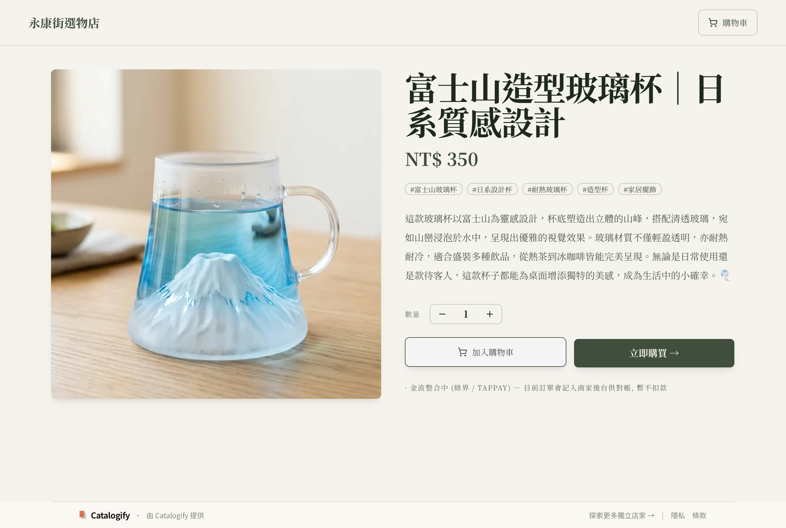
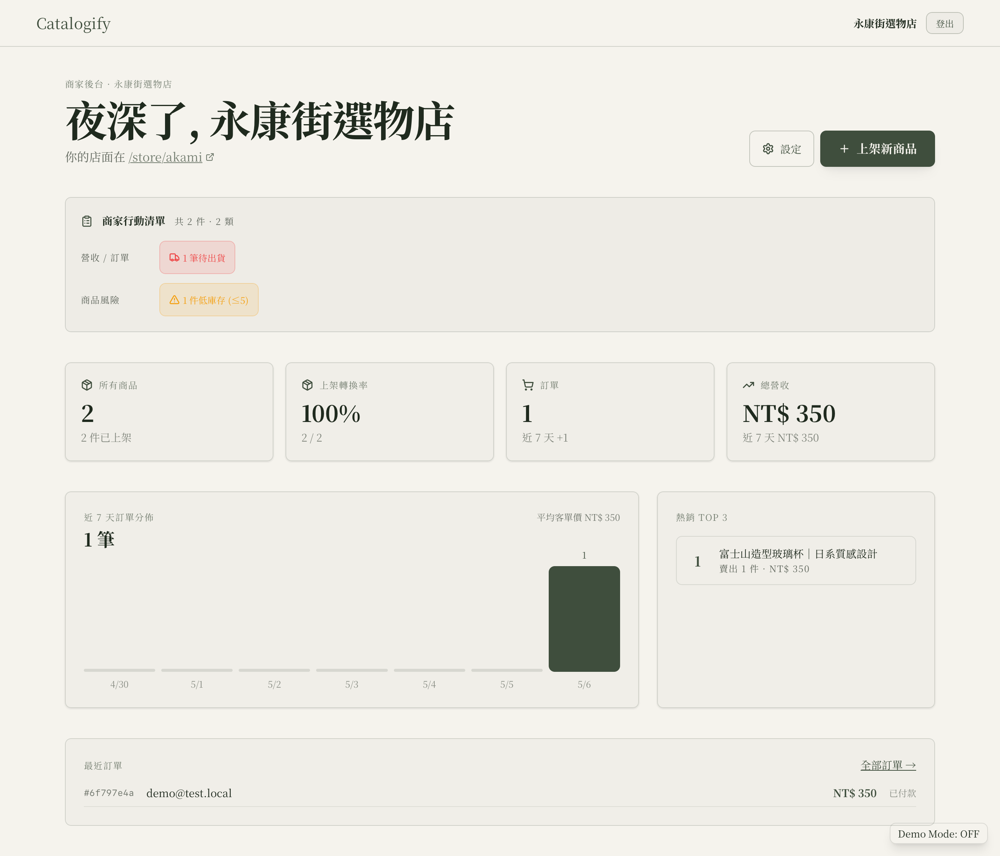
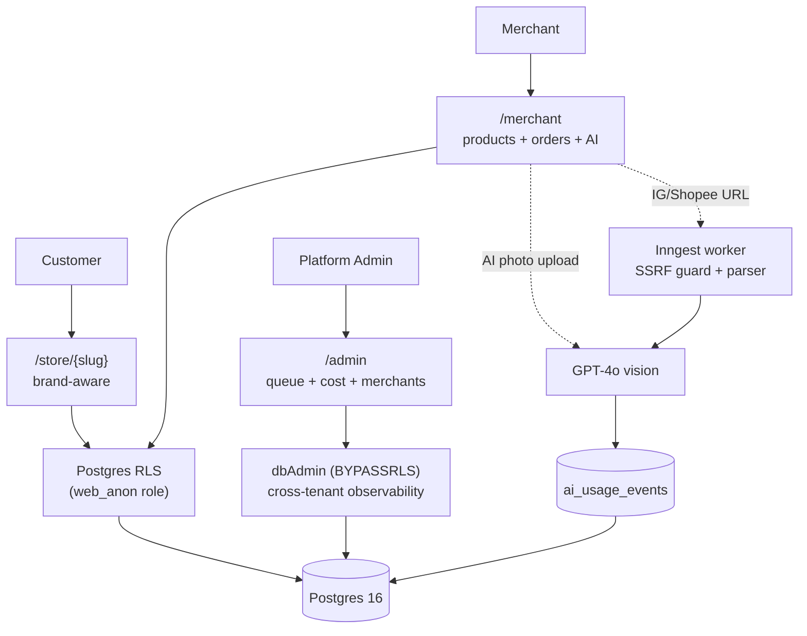

# demo-sass-2

> A multi-merchant e-commerce platform for Taiwan's independent stores. AI photo→listing in ~7 seconds, multi-tenant Postgres RLS, and a platform-admin observability suite — built as a portfolio project that started life as a hackathon and got pushed thirteen versions deeper to exercise real production patterns (cloud deploy, per-merchant auth, R2 storage, security hardening).

[](https://demo-sass-2.vercel.app)
[](#tests)
[]()
[]()
[](./LICENSE)

**Live:** https://demo-sass-2.vercel.app · **Storefront examples:** [/store/akami](https://demo-sass-2.vercel.app/store/akami) · [/store/afen](https://demo-sass-2.vercel.app/store/afen)

[](https://demo-sass-2.vercel.app)

### Walkthrough — photo → AI listing in ~60s

<video src="https://github.com/user-attachments/assets/86eb6f26-1708-4655-aeed-10b1795d9a23" autoplay loop muted playsinline controls poster="./docs/hero/walkthrough-poster.jpg"></video>

Real AI photo→listing flow on the local env.

If the embed above doesn't render (npm package page, mirror, or some browsers): [▶ Play walkthrough (V2.3 release asset, 1.7 MB)](https://github.com/vincent97277/ai-powered-e-commerce-listing/releases/download/v2.3/walkthrough.mp4) · [Source `.mp4` in repo](./docs/hero/walkthrough.mp4) · [Poster image](./docs/hero/walkthrough-poster.jpg)

> **Portfolio / showcase project.** Public for learning, hiring, and reference. Limited active maintenance — see [.github/CONTRIBUTING.md](./.github/CONTRIBUTING.md) before opening PRs.

## Stack

Next.js 15 (App Router, Turbopack) · React 19 · TypeScript (strict) · Drizzle ORM 0.45 · Postgres 16 (Docker / Neon) · Inngest · OpenAI GPT-4o · Tailwind v4 · shadcn/ui · Vitest 2 · Playwright

Cloud: Vercel (sin1) · Neon Singapore · Cloudflare R2 (APAC) · Inngest Cloud

## Features

- **Multi-tenant storefronts** at `/store/{slug}` with brand-aware theming (per-merchant CSS variables for color, font, radius — set on the layout, no per-component styling forks)
- **AI photo → product listing** in ~7 seconds (GPT-4o vision + per-merchant brand voice) for synchronous single-photo upload
- **One-click batch import** from Instagram and 蝦皮 with SSRF defense, per-batch cost cap, and live progress over Inngest
- **Per-merchant authentication** — email + bcrypt password + DB-backed sessions, separate from platform-admin sessions
- **Order lifecycle** 待付款 → 已付款 → 已出貨 → 已完成 / 退款 with optimistic concurrency, audit log, and A4 print shipping slip
- **Platform admin tools** — sortable merchant ranking, AI cost dashboard with anomaly detection, cross-merchant operator queue (P1–P5 severity inbox)
- **Production-shaped onboarding** — admin approval queue, reserved-slug list, IP rate limit, and honeypot defense, all without email or captcha
- **Security-first by construction** — Postgres RLS with `WITH CHECK`, HMAC-signed admin sessions with DB liveness check, hostname-allowlist SSRF guard, ESLint-enforced `dbAdmin` containment

## See it in action

Three personas, one codebase. RLS keeps tenants apart; `dbAdmin` (BYPASSRLS) is allowlisted to platform surfaces only.

| Storefront (顧客端) | Merchant dashboard (商家後台) |
|---|---|
| [](./docs/screenshots/storefront-product-detail.png) | [](./docs/screenshots/merchant-dashboard.png) |
| Brand-aware theming via per-merchant CSS vars; same `/store/{slug}` route, different visual identity per tenant. | KPI tiles, 7-day order chart, hot products, recent orders, action inbox — RLS-scoped to the logged-in merchant. |

| AI cost dashboard (平台管理) | Operator queue (跨商家客服) |
|---|---|
| [](./docs/screenshots/admin-ai-cost-dashboard.png) | [](./docs/screenshots/admin-operator-queue.png) |
| 14-day platform-wide AI token usage + per-merchant top-10. The cost cap is a load-bearing primitive — see `assertWithinDailyCap()`. | P1–P5 severity inbox aggregating action items across every tenant via cross-merchant CTE — `dbAdmin` BYPASSRLS, ESLint-allowlisted. |

[More screenshots →](./docs/screenshots/) (settings, product list, order detail, A4 print slip, storefront grid, success page, merchant ranking)

## Architecture



Deeper diagrams (data model, AI pipeline sequence, security layers) live in [ARCHITECTURE.md](./ARCHITECTURE.md).

## How to read this repo

| If you are... | Read in this order |
|---|---|
| **A human dev evaluating it** | This README → [ARCHITECTURE.md](./ARCHITECTURE.md) §1–§5 → [STATUS.md](./STATUS.md) summary table → live demo |
| **Cloning to run locally** | [LOCAL_SETUP.md](./LOCAL_SETUP.md) (TL;DR is 5 commands) → fall back to [DEPLOY.md](./DEPLOY.md) for cloud reproduction |
| **An AI agent assigned a task** | [CLAUDE.md](./CLAUDE.md) only — it's the self-contained agent doc with conventions, trip-wires, and pointers |
| **A potential contributor** | [.github/CONTRIBUTING.md](./.github/CONTRIBUTING.md) (limited maintenance — manage expectations first) |
| **Auditing the security model** | [ARCHITECTURE.md](./ARCHITECTURE.md) §2 (RLS) + §5 (security layers) + [tests/rls.e2e.test.ts](./tests/rls.e2e.test.ts) + [tests/import/url-guard.test.ts](./tests/import/url-guard.test.ts) |

## Quickstart

Requires: Node 22+, pnpm 9+, Docker.

```bash
# 1. Boot local Postgres + roles
pnpm docker:up

# 2. Env (defaults work for local; openssl rand for any required *_SECRET)
cp .env.local.example .env.local
# Required: generate MERCHANT_SESSION_SECRET (≥32 chars) — `/merchant/*` 503s without it.
echo "MERCHANT_SESSION_SECRET=$(openssl rand -hex 32)" >> .env.local

# 3. Install + migrate (uses the custom runner — never `pnpm db:push` for onboarding)
pnpm install
pnpm db:migrate

# 4. Seed demo merchants (akami + afen + 5 others, dev mode = shared `demo1234`)
pnpm tsx scripts/seed-merchant-auth.ts

# 5. Run
pnpm dev          # http://localhost:3000

# 6. Test
pnpm vitest run   # 260+ tests
```

**Demo logins** (dev mode only):
- Merchant: `akami@demo.local` or `afen@demo.local` / password `demo1234`
- Admin: whatever you put in `ADMIN_PASSWORD` in `.env.local` (default `changeme`)

Full setup, env vars, RLS gotchas, sample data: [LOCAL_SETUP.md](./LOCAL_SETUP.md).

If `pnpm install` shouts at you for using the wrong package manager, that's intentional — `only-allow` enforces pnpm to prevent silent lockfile drift.

## Tests

| Layer | Approx | File |
|---|---|---|
| RLS isolation (e2e) | 8 | `tests/rls.e2e.test.ts` |
| Admin auth (e2e) | 15 | `tests/admin-auth.e2e.test.ts` |
| Merchant auth (e2e) | 15+ | `tests/merchant-auth.e2e.test.ts` |
| Admin search + filter + pagination | 8 | `tests/admin-search.test.ts` |
| Operator queue (cross-tenant CTE) | 5 | `tests/admin/operator-queue.test.ts` |
| AI cost cap | 15 | `tests/ai/cost-cap.test.ts` |
| URL guard / SSRF | 15 | `tests/import/url-guard.test.ts` |
| IG / Shopee fetchers | 8 | `tests/import/{ig,shopee}-fetcher.test.ts` |
| Shopee CSV export | 6 | `tests/export/shopee-csv.test.ts` |
| Onboarding security | 9 | `tests/onboarding/security.test.ts` |
| Storage facade (local + R2) | 17 | `tests/storage/facade.test.ts` |
| Env validation | 11 | `tests/env/env-validation.test.ts` |
| Theme matching | 16 | `tests/themes/match.test.ts` |
| Migration runner | varies | `tests/db/migrate-runner.test.ts` |
| Feedback state primitives | 18 | `tests/components/feedback.test.tsx` |
| V1 integration (HTTP) | 43 | `tests/v1-integration.test.ts` |
| **Total vitest (V2.3)** | **260+** | |
| **Manual smoke** | 25 steps | `tests/v1-smoke.md` |

Counts shift between versions; the source of truth is `pnpm vitest run`. The CI badge above tracks the current pass count.

## Why this is interesting

For folks reading the source:

- **RLS done right.** Every tenant write goes through `withTenantTx(tenantId, fn)` → `SET LOCAL app.tenant_id` inside a transaction, with a UUID-format guard before the `set_config` call. Migrations include `WITH CHECK` to block cross-tenant inserts (not just selects). See `src/lib/db/with-tenant.ts` and the 8 RLS e2e cases including a web_anon role-escalation test.
- **SSRF defense via hostname allowlist, not regex.** `assertSafeUrl()` parses with `new URL()`, checks `hostname` against two separate allowlists (source vs CDN), DNS-resolves and rejects RFC1918 / loopback / link-local v4+v6 to defeat DNS rebinding, follows redirects manually with re-validation per hop, and enforces a 5MB body cap and 10s timeout. See `src/lib/import/url-guard.ts` and 15 unit cases.
- **AI cost cap as a load-bearing primitive.** `ai_usage_events` (sync path) + `import_sessions.tokens_in/out` (batch path) are both aggregated by `getDailyCostCents()`. `assertWithinDailyCap()` gates every AI call and returns 429 when over. The USD→TWD rate is extracted to its own file (`ai-cost-pricing.ts`) so platform-cost code can't silently re-derive it and drift.
- **Admin observability without leaking RLS.** `dbAdmin` (BYPASSRLS role) is restricted by an ESLint `no-restricted-imports` allowlist — only `(admin)/**`, `lib/observability/**`, `lib/admin/**`, `lib/onboarding/**`, the Inngest workers, and a handful of system queries can import it. UI code physically cannot bypass tenant isolation.
- **Production-shaped onboarding without email or captcha.** Admin approval queue (`approved_at IS NULL` = blocked storefront + merchant-side banner) + 28-entry reserved-slug list + DB-backed IP rate limit (1 success / IP / 24h via `onboarding_attempts`) + honeypot field. All five abuse paths are logged for admin review.
- **Defense-in-depth admin sessions.** Edge middleware verifies the HMAC cookie; the `(admin)` layout additionally calls `validateAdminSession()` against the DB so revoked sessions can't keep working. (Codex caught the missing layout check during V1.6 review.)
- **V2.2 cloud deploy** at $0/mo idle — Vercel sin1 + Neon Singapore (free tier) + Cloudflare R2 (free tier 10GB) + Inngest Cloud (free tier). [DEPLOY.md](./DEPLOY.md) is the full Phase B/C/D runbook.

## Project status

Thirteen versions shipped, V1 → V2.3:

| Version | Theme | Tests |
|---|---|---|
| V1 | Hackathon multi-merchant platform (Phases 1–7) | 81 |
| V1.5 | AI cost cap + 健康度 + Export 統一收口 (Gemini swap reverted) | 102 |
| V1.6 | Admin scale tools + state primitives + dashboard IA | 141 |
| V1.7 | Onboarding security + switcher scale + dead code | 154 |
| V1.8–V1.9 | Portfolio docs + UI overhaul (token foundation, brand identity) | 160 |
| V2.0 | Per-merchant authentication (email + password + DB sessions) | 195 |
| V2.1 | 18 theme presets + brand-voice auto-match | 211 |
| V2.2 | **Cloud deploy** — Vercel + Neon + R2 + Inngest, plus 4 critical + 7 high /autoplan blockers fixed | 256 |
| V2.3 | Throughput improvements — Dependabot auto-merge, post-deploy smoke, branch protection, drizzle-orm 0.45 upgrade, OSS readiness | 260+ |

Per-version detail: [STATUS.md](./STATUS.md). Commit-level history: [CHANGELOG.md](./CHANGELOG.md). Standing engineering rules: [DECISIONS.md](./DECISIONS.md).

## License

Apache 2.0. See [LICENSE](./LICENSE).
