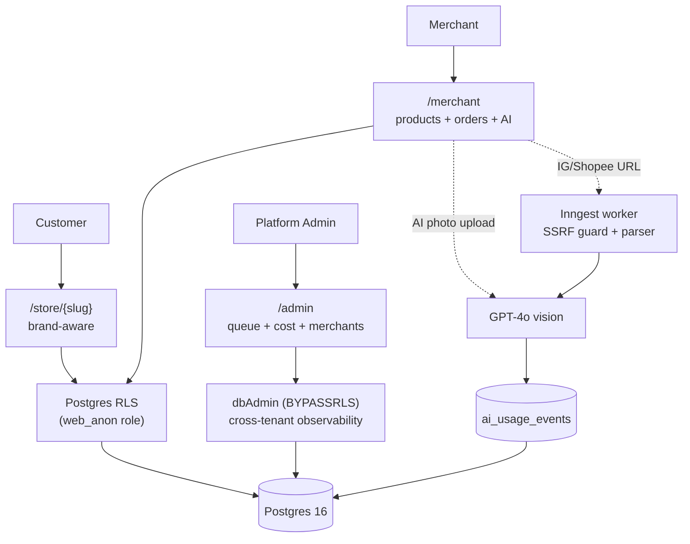

# demo-sass-2

> A multi-merchant e-commerce platform for Taiwan's independent stores. AI photo-to-listing in 7 seconds, multi-tenant Postgres RLS, and a platform-admin observability suite — built as a portfolio project that started life as a hackathon and got pushed four versions deeper to exercise real production patterns.

[](https://demo-sass-2.vercel.app)
[]()
[]()
[]()
[](./LICENSE)

**Live:** https://demo-sass-2.vercel.app · **Storefront examples:** [/store/akami](https://demo-sass-2.vercel.app/store/akami) · [/store/afen](https://demo-sass-2.vercel.app/store/afen)

## Stack

Next.js 15 (App Router, Turbopack) · React 19 · TypeScript · Drizzle ORM · Postgres 16 (Docker) · Inngest · OpenAI GPT-4o · Tailwind v4 · shadcn/ui · Vitest

## Features

- **Multi-tenant storefronts** at `/store/{slug}` with brand-aware theming (per-merchant CSS variables for color, font, radius — set on the layout, no per-component styling forks)
- **AI photo to product listing** in ~7 seconds (GPT-4o vision + per-merchant brand voice) for synchronous single-photo upload
- **One-click batch import** from Instagram and 蝦皮 with SSRF defense, per-batch cost cap, and live progress over Inngest
- **Order lifecycle** 待付款 → 已付款 → 已出貨 → 已完成 / 退款 with optimistic concurrency, audit log, and A4 print shipping slip
- **Platform admin tools** — sortable merchant ranking, AI cost dashboard with anomaly detection, cross-merchant operator queue (P1–P5 severity inbox)
- **Production-shaped onboarding** — admin approval queue, reserved-slug list, IP rate limit, and honeypot defense, all without email or captcha
- **Security-first by construction** — Postgres RLS with `WITH CHECK`, HMAC-signed admin sessions with DB liveness check, hostname-allowlist SSRF guard, ESLint-enforced `dbAdmin` containment

## Architecture



Deeper diagrams (data model, AI pipeline sequence, security layers) live in [ARCHITECTURE.md](./ARCHITECTURE.md).

## Quickstart

```bash
# 1. Boot local Postgres + roles
docker compose up -d

# 2. Install + migrate
bun install
bun run db:push      # forward migrations 0000..0007

# 3. Run
bun run dev          # http://localhost:3000

# 4. Test
bunx vitest run      # 154 tests
```

Full setup, env vars, gotchas: [LOCAL_SETUP.md](./LOCAL_SETUP.md).

## Tests

| Layer | Count | File |
|---|---|---|
| RLS isolation (e2e) | 8 | `tests/rls.e2e.test.ts` |
| Admin auth (e2e) | 15 | `tests/admin-auth.e2e.test.ts` |
| Admin search + filter + pagination | 8 | `tests/admin-search.test.ts` |
| Operator queue (cross-tenant CTE) | 5 | `tests/admin/operator-queue.test.ts` |
| AI cost cap | 15 | `tests/ai/cost-cap.test.ts` |
| URL guard / SSRF | 15 | `tests/import/url-guard.test.ts` |
| IG fetcher | 5 | `tests/import/ig-fetcher.test.ts` |
| Shopee fetcher | 3 | `tests/import/shopee-fetcher.test.ts` |
| Shopee CSV export | 6 | `tests/export/shopee-csv.test.ts` |
| Onboarding security | 9 | `tests/onboarding/security.test.ts` |
| Merchant switcher scale | 4 | `tests/merchant-switcher.test.ts` |
| Feedback state primitives | 18 | `tests/components/feedback.test.tsx` |
| V1 integration | 43 | `tests/v1-integration.test.ts` |
| **Total vitest** | **154** | |
| **Manual smoke** | **25 steps** | `tests/v1-smoke.md` |

## Why this is interesting

For folks reading the source:

- **RLS done right.** Every tenant write goes through `withTenantTx(tenantId, fn)` → `SET LOCAL app.tenant_id` inside a transaction, with a UUID-format guard before the `set_config` call. Migrations include `WITH CHECK` to block cross-tenant inserts (not just selects). See `src/lib/db/with-tenant.ts` and the 8 RLS e2e cases including a web_anon role-escalation test.
- **SSRF defense via hostname allowlist, not regex.** `assertSafeUrl()` parses with `new URL()`, checks `hostname` against two separate allowlists (source vs CDN), DNS-resolves and rejects RFC1918 / loopback / link-local v4+v6 to defeat DNS rebinding, follows redirects manually with re-validation per hop, and enforces a 5MB body cap and 10s timeout. See `src/lib/import/url-guard.ts` and 15 unit cases.
- **AI cost cap as a load-bearing primitive.** `ai_usage_events` (sync path) + `import_sessions.tokens_in/out` (batch path) are both aggregated by `getDailyCostCents()`. `assertWithinDailyCap()` gates every AI call and returns 429 when over. The USD→TWD rate is extracted to its own file (`ai-cost-pricing.ts`) so platform-cost code can't silently re-derive it and drift.
- **Admin observability without leaking RLS.** `dbAdmin` (BYPASSRLS role) is restricted by an ESLint `no-restricted-imports` allowlist — only `(admin)/**`, `lib/observability/**`, `lib/admin/**`, `lib/onboarding/**`, the Inngest workers, and a handful of system queries can import it. UI code physically cannot bypass tenant isolation.
- **Production-shaped onboarding without email or captcha.** Admin approval queue (`approved_at IS NULL` = blocked storefront + merchant-side banner) + 28-entry reserved-slug list + DB-backed IP rate limit (1 success / IP / 24h via `onboarding_attempts`) + honeypot field. All five abuse paths are logged for admin review.
- **Defense-in-depth admin sessions.** Edge middleware verifies the HMAC cookie; the `(admin)` layout additionally calls `validateAdminSession()` against the DB so revoked sessions can't keep working. (Codex caught the missing layout check during V1.6 review.)

## Project status

Four versions shipped:

| Version | Theme | Tests |
|---|---|---|
| V1 | Hackathon multi-merchant platform (Phases 1–7) | 81 |
| V1.5 | Cost cap + 健康度 + Export 統一收口 (Gemini swap reverted) | 102 |
| V1.6 | Admin scale tools + state primitives + dashboard IA | 141 |
| V1.7 | Onboarding security + switcher scale + dead code | 154 |

Per-version notes: [STATUS.md](./STATUS.md) · Commit history: [CHANGELOG.md](./CHANGELOG.md)

## License

MIT. See [LICENSE](./LICENSE).
